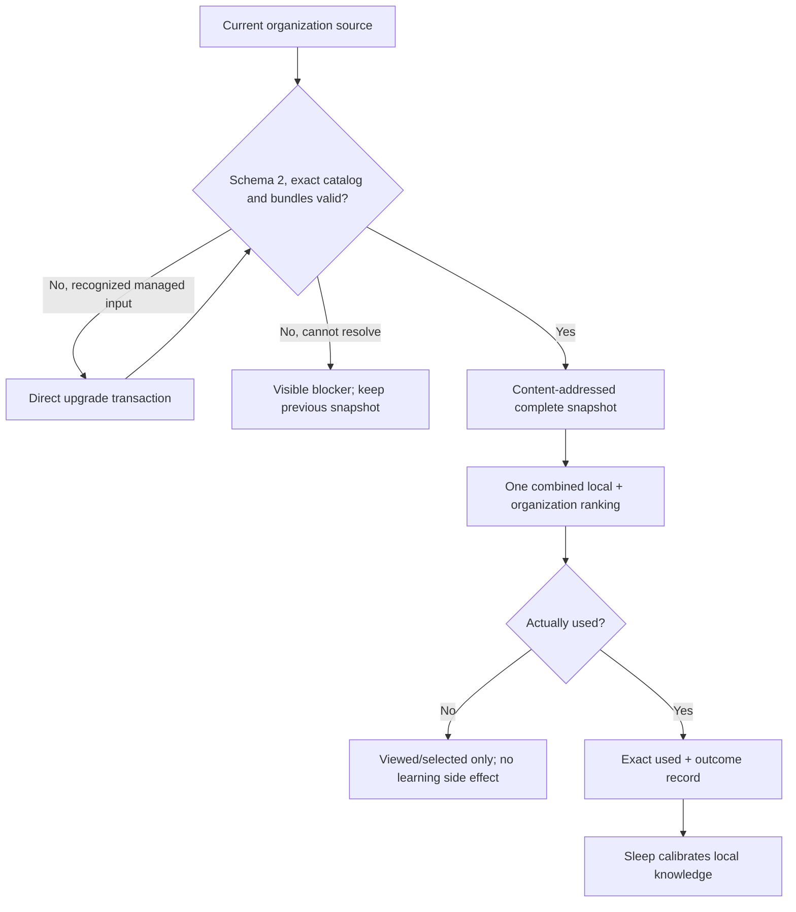

# Organization Functional Acceptance

This is the current acceptance contract for organization mode. It replaces the
retired download/adoption/automatic-Skill-install flow.

## Acceptance Model

## 1. Source And Direct Upgrade

Pass conditions:

- normal runtime accepts only a complete current schema-2 source;
- every active catalog identity has an exact card and LogicGuard bundle;
- `kb/imports` remains review input and is not exposed as the active download
  surface;
- recognized schema-1 cards upgrade directly to current models/bundles/catalog;
- deterministic duplicate identities produce the same disposition on replay;
- exact duplicates retire without losing provenance;
- a failed current validation rolls the owned tree back;
- obsolete roots and uncataloged cards remain visible failures in normal
  runtime.

Evidence owner: `tests/test_org_sources.py`.

## 2. Complete Foreign Snapshot

Pass conditions:

- the snapshot copies the exact active catalog/card/bundle identity set;
- its directory and pointer are content-addressed;
- an unchanged source reuses the same immutable generation;
- a changed but invalid source cannot replace the prior pointer;
- a legacy raw card cannot enter snapshot runtime;
- ordinary retrieval reads the current snapshot only and performs no network
  operation.

Evidence owner: `tests/test_org_snapshot.py` plus the no-network cases in the
multi-source retrieval suite.

## 3. Unified Retrieval

Pass conditions:

- local and organization candidates enter one global ranking before the result
  limit is applied;
- one request returns one combined receipt with exact result references;
- every organization result keeps foreign/read-only, generation, revision,
  LogicGuard binding, freshness, and source metadata;
- a high-quality organization result may rank above a weaker local result;
- the same visible card id from two sources remains distinguishable by exact
  result reference;
- current organization results come only from active catalog statuses;
- obsolete organization roots fail visibly instead of activating a second
  reader.

Evidence owner: `tests/test_multi_source_search.py`.

## 4. Interaction And Outcome

Pass conditions:

- `viewed`, `selected`, `used`, and `outcome_recorded` are distinct monotonic
  interaction stages;
- opening a card detail records at most `viewed` and never `used`;
- an outcome must reference a result returned by the exact combined receipt;
- a foreign use is source-qualified and cannot be confused with a same-id local
  result;
- required interaction failures remain visible to the caller;
- no result view/use creates a local adopted copy, directly publishes a local
  model, or installs a Skill;
- removed adoption and automatic-install entrypoints fail visibly rather than
  silently falling back.

Evidence owners: `tests/test_multi_source_search.py`,
`tests/test_organization_adoption.py`, and
`tests/test_kb_retrieval_calibration.py`.

## 5. Sleep Calibration

Pass conditions:

- only an exact foreign `used` record with an exact outcome can enter Sleep
  calibration;
- useful, harmful, stale, and irrelevant outcomes remain source-qualified;
- Sleep may change local applicability/weight, create a candidate, or retain an
  observation, but the foreign card never becomes local authority by copying;
- only the authorized Sleep publisher may rebuild the local generation;
- Dream observes the pinned generation and cannot publish it.

Evidence owner: the calibration, lifecycle, local-cycle, and Dream suites.

## 6. Two Scheduled Owners

Pass conditions:

- maintained inventory = five Skills;
- scheduled inventory = `kb-sleep-maintenance` and
  `kb-organization-maintenance` only;
- composite children = `kb-dream-pass` and
  `kb-organization-contribute` only;
- explicit-user-only inventory = `khaos-brain-update` only;
- Dream and contribution have no independent scheduled automation;
- local and organization task leases are independent;
- Sleep failure marks only Dream `not_run` and does not write organization task
  status;
- organization failure marks only its own later child phases `not_run`;
- overlapping durable mutation is serialized by one global writer;
- delegated child writers bind the exact parent token;
- expired ownership requires explicit cleanup confirmation.

Evidence owners: `tests/test_current_automation_runtime.py`,
`tests/test_maintenance_lanes.py`, `tests/test_local_maintenance_cycle.py`, and
`tests/test_organization_cycle.py`.

## 7. Cycle Receipts

Pass conditions:

- both cycles use the current immutable receipt-v3 contract;
- local phase order is Sleep, then Dream only after the required Sleep terminal;
- organization phase order is source sync/upgrade/validation, maintenance,
  contribution, and complete snapshot publication;
- a receipt binds normalized request, source/tool identity, generations, task
  lease, global/delegated writer token, ordered child receipts and hashes,
  outputs, cleanup evidence, and terminal status;
- reuse requires exact terminal success and exact identity match;
- same run id with a changed request, tampered receipt, stale source, partial
  phase, failed/blocked/timed-out result, or missing cleanup evidence is rejected;
- strict statuses are preserved and never promoted to generic completion.

Evidence owners: the local-cycle and organization-cycle suites.

## 8. Maintenance, Merge And Split

Pass conditions:

- maintenance coverage compares exact active catalog identities, not only card
  counts;
- every merge/split candidate has either a complete apply packet or a concrete
  reopen contract;
- exact selected decision ids are the only mutations applied;
- evidence-insufficient merge/split remains unresolved without falsely failing
  an otherwise complete audit cycle;
- applied changes rebuild current cards, bundles, and catalog together;
- rollback material preserves exact prior identities and content hashes;
- contribution respects privacy, duplicate, author, hash/version, fork, and
  protected-branch policy.

Evidence owners: `tests/test_org_cleanup.py`,
`tests/test_org_maintenance.py`, organization contribution/check suites, and the
full organization-cycle integration case.

## 9. UI And Human Inspection

Pass conditions:

- source labels clearly distinguish local authority from foreign organization
  context;
- organization details show generation, revision, contributor, freshness, and
  read-only state;
- UI detail-open never records use;
- there is no adoption button or implied adoption queue;
- there is no card-triggered Skill install action;
- snapshot/organization-cycle errors and interaction-write errors are visible.

Evidence owner: retrieval/UI focused tests and the runnable desktop UI check.

## 10. Frozen Release Gate

The release is accepted only when one frozen source snapshot has:

- passing current FlowGuard model-system, two-task model, FieldLifecycleMesh,
  ModelMesh, behavior commitment ledger, Model-Test Alignment, and TestMesh;
- strict OpenSpec validation with every implemented task reconciled;
- current source-only SkillGuard supervision for all five maintained Skills;
- one terminal full-regression owner with complete JUnit node inventory and no
  failed, errored, skipped, unparsed, missing, or stale required child;
- successful transactional install and independent `--check` projection audit;
- exactly one real local wrapper run and one real organization wrapper run, each
  reported by its own immutable receipt (including `not_applicable` honestly);
- separately reported source, install, runtime, Git/main CI, tag CI, and GitHub
  release identities.
