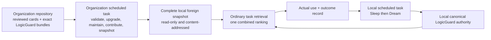

# Organization Mode Plan

## Purpose

Organization mode lets several machines exchange a small number of reviewed,
experience-shaped cards. It does not exchange raw observation streams and it
does not copy organization cards into the local canonical knowledge base.

The organization repository is a shared source. Each participating machine
keeps a complete validated snapshot of that source locally. Ordinary task
retrieval searches the local canonical index and the cached organization
snapshot together, ranks all results in one pass, and may use a relevant
organization card directly as foreign read-only context. No user adoption
button, task-time download, local adopted copy, direct model publication, or
card-triggered Skill installation exists in the normal path.

Only Sleep may turn evidence from a useful organization card into local
canonical knowledge. It does this from an exact use/outcome record, under the
same evidence and lifecycle rules as any other local observation.

## The Whole Flow In Plain Language

The two scheduled tasks are independent:

- `KB Sleep` owns the local task. Sleep runs first. Dream is an internal,
  immutable verification phase and runs only after Sleep reaches the required
  local terminal.
- `KB Organization Maintenance` owns the organization task. It synchronizes
  and validates the organization source, performs organization maintenance,
  runs contribution as an internal phase, and publishes the complete local
  foreign snapshot.

One task failing does not mark the other task `not_run`. They use separate task
leases and failure domains. When both need to mutate overlapping durable state,
they briefly serialize through one global write lease. A child phase may use
the parent task's exact delegated write token; it must not acquire a competing
global writer.

## What Is Shared

The shared unit is a reviewed card package:

- one canonical organization card projection;
- one exact LogicGuard model binding;
- the required bundle and mesh references;
- provenance, scope, revision, freshness, privacy, and contributor metadata;
- stable exchange and duplicate identities;
- no executable Skill payload that is installed merely because the card is
  present.

Raw local observations, private history, user preferences, credentials, local
paths, customer data, and arbitrary working files are not organization exchange
units. A local machine may contribute a newly generalized card only after its
normal privacy and evidence gates pass.

## Organization Repository Contract

Normal runtime accepts only the current organization source contract. Older
managed layouts or card packages are upgrade input, not alternate readers.
The organization task upgrades them directly to the current contract inside a
rollbackable transaction and requires zero incompatible residuals before it can
publish a snapshot.

The current repository has:

- `khaos_org_kb.yaml` as the current repository manifest;
- `kb/main/` for active reviewed card projections;
- `kb/imports/` for contribution/review inputs;
- `kb/logicguard/bundles/` for exact card-bound LogicGuard packages;
- `kb/organization_catalog.json` for the current complete catalog;
- `skills/` only as an explicitly reviewed organization registry, never as an
  automatic side effect of card synchronization or card use;
- `audit/` for review, cleanup, merge/split, migration, and receipt evidence.

Every active card identity in the catalog must have exactly one current card
projection and one valid LogicGuard binding. Counts alone are insufficient:
validation compares the exact set of eligible active identities.

## Direct Upgrade Of Old Organization Cards

When the organization task encounters an older managed card/package shape, the
upgrade AI does not preserve a compatibility reader. It:

1. freezes the source revision and exact active-card inventory;
2. inventories old cards, bundles, catalog rows, and obsolete roots;
3. derives one evidence-bound direct-to-current disposition for every item;
4. assigns stable duplicate/decision identities;
5. builds the current card projection and exact LogicGuard bundle;
6. validates exact catalog/card/bundle coverage;
7. stages a complete content-addressed snapshot;
8. publishes the new pointer last;
9. records rollback evidence and requires zero incompatible residuals.

Missing evidence is not silently invented. A card that cannot yet be upgraded
remains an explicit unfinished upgrade item and blocks publication of a false
complete snapshot.

## Complete Local Foreign Snapshot

The organization task downloads and validates the complete active organization
set before ordinary task retrieval needs it. The snapshot is immutable and
content-addressed. Its identity binds at least:

- organization/source identity and commit;
- organization schema and catalog digest;
- exact active card identities and revisions;
- exact LogicGuard bundle/model bindings;
- validation result and freshness state;
- snapshot content digest and generation;
- previous pointer needed for rollback.

Publishing uses copy-on-write staging and atomic pointer replacement. A failed
or interrupted refresh leaves the previous complete snapshot readable. It must
not delete or partially overwrite the current snapshot.

Ordinary retrieval reads only the current pointer. It never reads a mutable Git
working tree and never performs a network fetch on a miss.

## Retrieval And Use

One retrieval request produces one combined result list and one combined
receipt. Local and organization candidates are scored in the same ranking pass;
neither source gets a hidden local-first truncation advantage.

Every result keeps its source boundary visible:

- `local` means current local canonical authority;
- `organization` means the current foreign snapshot;
- organization results retain organization generation, card revision,
  LogicGuard binding, freshness, and source identity;
- a foreign result is always read-only, even when it ranks first.

The interaction lifecycle is explicit:

1. `viewed`: the result was displayed or its details were opened;
2. `selected`: the agent chose it as relevant to the task;
3. `used`: its content actually influenced an action or answer;
4. `outcome_recorded`: the task result was recorded against that exact use.

Viewing is not use. Selection is not use. A UI detail-open must not create a
use record. Errors while recording a required interaction remain visible; the
UI must not swallow them and claim success.

## Local Assimilation By Sleep

An organization use/outcome record is evidence, not authority. During the next
local task, Sleep evaluates whether it should change local knowledge:

- helpful in the same boundary may strengthen or refine an existing local
  card;
- helpful in a new reusable boundary may create a local candidate;
- harmful, irrelevant, stale, or contradicted use may weaken applicability or
  record a counterexample;
- one weak outcome may remain observation-only;
- no outcome directly copies an organization card into local authority.

Sleep publishes any accepted local model/projection/index changes atomically.
Dream may pressure-test the resulting immutable generation and return typed
model gaps to a later Sleep run, but Dream cannot publish canonical authority.

## Organization Maintenance And Contribution

The organization task runs one pinned-source cycle:

1. acquire its task lease;
2. synchronize and directly upgrade the source if required;
3. validate exact current card/bundle/catalog coverage;
4. acquire the global writer only for overlapping durable mutation;
5. analyze duplicates, stale cards, conflicts, and merge/split opportunities;
6. apply only evidence-supported maintenance actions;
7. emit explicit apply packets and reopen conditions for unresolved decisions;
8. run contribution once as a child phase;
9. build and validate the complete content-addressed foreign snapshot;
10. publish its pointer last and release all leases;
11. write one immutable terminal cycle receipt.

Merge and split operations are reversible. They retain source identities,
pre-change content hashes, replacement identities, evidence, decision reason,
and restoration instructions. A similarity score alone cannot authorize a
merge; an oversized card alone cannot authorize a split. Insufficient evidence
creates an unresolved checkpoint with a concrete reopen condition rather than
a fabricated change or an unexplained global failure.

Contribution exports only public, reusable, non-duplicate local card packages
that pass privacy and provenance gates. It does not upload raw observations or
clean copies of organization cards. Contribution writes to the configured
branch/import workflow and never directly mutates the protected active source
without its repository policy.

## Receipts And Reuse

Both scheduled owners publish immutable cycle receipts using the current v3
contract. A reusable terminal-success receipt binds:

- normalized request and task identity;
- repository/source/tool/environment fingerprints;
- task lease and any global/delegated writer token;
- pinned local or organization generations;
- ordered child phases and exact child receipt paths/hashes;
- outputs and content digests;
- cleanup and lock-release evidence;
- one strict terminal status.

A matching run id is never enough. Partial, blocked, failed, timed-out,
cancelled, stale, input-mismatched, missing-child, or cleanup-unconfirmed
receipts cannot be reused or promoted to success.

## Installation And Scheduling

The installed maintained inventory contains five Skills but only two scheduled
automations:

| Class | Skills | Scheduled separately |
|---|---|---|
| Scheduled owner | `kb-sleep-maintenance`, `kb-organization-maintenance` | Yes |
| Composite child | `kb-dream-pass`, `kb-organization-contribute` | No |
| Explicit user action | `khaos-brain-update` | No |

The default working-hours schedule keeps the local task around midday and the
organization task in a later repository-derived window. Jitter and separate
leases prevent routine overlap; the global writer still provides hard safety if
they meet.

Personal mode installs and activates only the local task. Organization mode
activates both scheduled owners. Changing mode does not invent additional Dream
or contribution timers.

## UI Boundary

The desktop may show:

- whether organization mode is configured and the last snapshot is current;
- local versus organization source labels;
- organization generation, freshness, contributor, and read-only state;
- interaction/outcome status;
- organization-cycle health and explicit blockers.

It does not need an adoption queue or an adoption button. It does not install a
Skill when a card is opened. It does not hide interaction write failures.

## Acceptance Criteria

Organization mode is complete only when all of the following are proven on one
frozen source snapshot:

- exactly two scheduled automation IDs exist and the two child Skills have no
  independent timers;
- one local blocker does not suppress the organization task, and vice versa;
- every active organization card has exact current catalog and LogicGuard
  bundle coverage;
- old organization formats upgrade directly or remain visible blockers;
- snapshot publication is complete, immutable, content-addressed, atomic, and
  rollbackable;
- ordinary retrieval performs no network I/O and returns one combined ranked
  receipt across local and organization sources;
- viewed, selected, used, and outcome states cannot be confused;
- actual foreign use can reach Sleep calibration without local adoption;
- organization presence/use never directly publishes local authority or
  installs a Skill;
- merge/split decisions are evidence-bound and reversible;
- receipts reject stale, partial, timed-out, mismatched, or cleanup-unconfirmed
  reuse;
- source, installed projection, runtime receipt, Git commit, CI result, tag,
  and release identities are reported separately.
